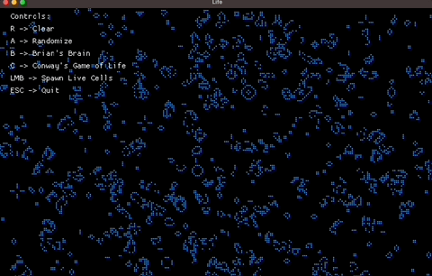

# About this project

A few of the popular cellular automatons, such as Conway's Game of Life and Brian's Brain, implemented in Rust and
visualized via [macroquad](https://macroquad.rs/).

Code was optimized for readability and extensibility over performance.

Try this project in your browser via WebAssembly: https://phantomgoose.github.io/automata

Run this project with `cargo run --release` for best performance.

